#           《企业应用框架》研究生任务一 

1. ##  Git/Github的基本操作

   （1）建立一个Repository ，命名规则 test_姓名拼音（全拼） 

   （2）复制repository的地址，并通过git命令下载到本地 

   （3）在本地添加一个文件 ，并添加一段文字，通过add,commit ,push上传到github.

   步骤已录视频。

   <video src="C:\Users\Qoo\Desktop\企业应用开发框架作业一\任务1.1操作步骤.wmv"></video>

2. ## 安装JDK1.8与IDEA 2019 ，配置Maven，能够运行一个基于Springboot简单的程序。

   ### （1）安装JDK1.8

   ​      1）去Oracle官网下载JDK1.8。

   地址为https://www.oracle.com/java/technologies/javase/javase-jdk8-downloads.html

   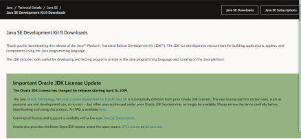

   选择下图的版本进行下载。

    

   ​    2）下载完后，点击.exe文件，进行安装。因写文档前已安装完，故不再粘贴图片。

   安装后，需要配置环境变量。桌面“我的电脑”右击，选择“属性”打开“系统控制面板”选择“高级系统设置”。

   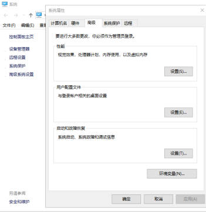

      3）配置JAVA_HOME，选择新建，输入变量名和jdk安装路径；

   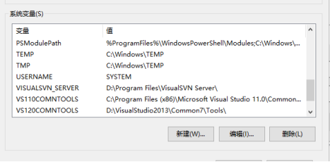

   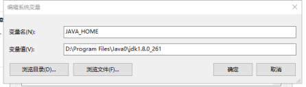

   ​    4）配置PATH，变量值填写JDK的安装目录下的bin目录。

   ​    5）配置CLASSPATH，变量值填写JDK相关的jar包，也是通过JAVA_HOME变量来设置，可直接写 %JAVA_HOME%\lib\dt.jar;%JAVA_HOME%\lib\tools.jar。

   ### （2）配置Maven

   ​      1）从官网直接下载，地址为：http://maven.apache.org/download.cgi。

   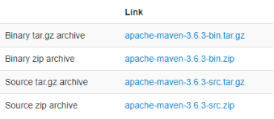

   ​    2）下载完，解压即可。

   ​    3）解压后，配置环境变量。添加系统变量，变量名为M2_HOME, 变量值为Maven的解压目录。在Path环境变量处，增加新的变量值：%M2_HOME%\bin。

   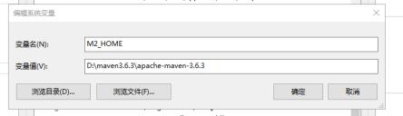

   ​    4）在自己选定的位置创建文件夹，作为本地仓库，来存放jar包。

   

   ​    5）用IDEA打开Maven目录下conf下的settings.xml文件，在settings标签下添加本地仓库的绝对路径和增加国内镜像的相关代码。

   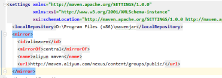

   ### （3）运行一个基于Springboot简单的程序

   ​     1）新建一个project，选择Spring Initializr，选择SDK为1.8，点击Next。

   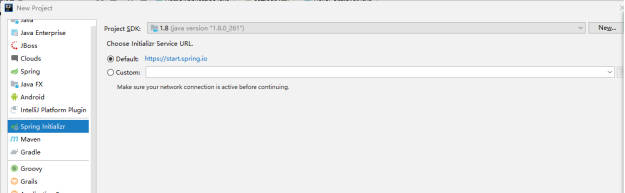

   ​     2）进行如下设置，将Java version选择为8，点击Next。

   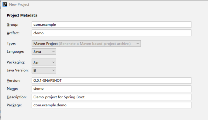

   ​     3）选择Web选项后，在选取Spring Web后，点击next。

   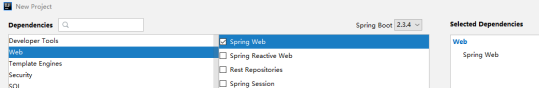

   ​    4）然后在com.example.demo的目录下，添加新的package controller，并添加.java文件helloworld。

   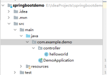

      5）编写helloworld.java。代码如下

   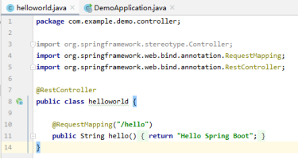 

     6）运行项目启动类DemoApplication.java 。

   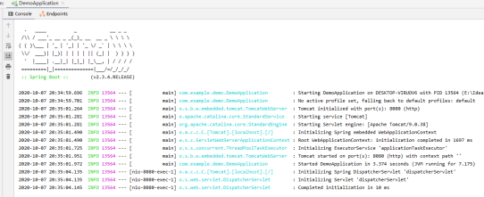 

   ​    7）在浏览器中输入http://localhost:8080/hello，即可查看运行结果。

   

3. ## 通过开发环境IDEA配置Git和GitHub，通过IDEA实现仓库的fork,  add，commit, push。

   ## （1）通过开发环境IDEA配置Git和GitHub

   ​       1）在Settings中设置git.exe路径。File-->Settings-->Version Control-->Git/GitHub。

   ​                            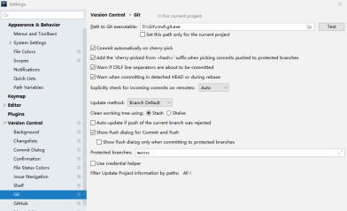

   ​      2）登录Github账户

   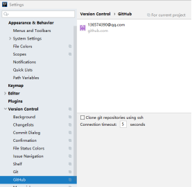

    

   

   ## （2）通过IDEA实现仓库的fork, add,commit,push

    1）fork  

   从GitHub上clone项。点击File ->New->Project from Version Control。然后设置GitHub地址以及存储路径。最后点击Clone。

   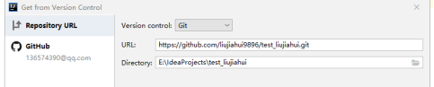

   2）add

      新建两个.java文件（test1.java和test2.java）。添加完后会弹出：

   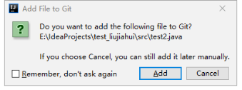

    点击add后，两个文件变绿：

   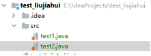

   3）commit

   提交文件按 VCS-->Git-->Commit Changes。

   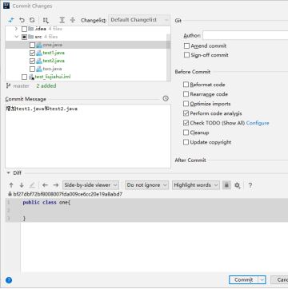

   4）push

   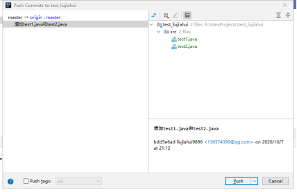

   点击push。结果如下图，push成功。

   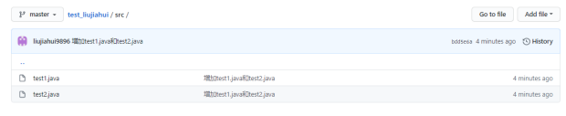

4. # 学习搭建虚拟机，利用VMWare搭建CentOS环境，能够和Windows机器共享资源，掌握基本命令的使用，能够搭建Docker服务器

   ## （1）利用VMWare搭建CentOS环境，能够和Windows机器共享资源，掌握基本命令的使用。

   1）首先就是下载安装VMWare和下载CentOS，我下载的版本是VMWare15和CentOS7。

   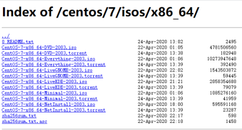

   2）然后是搭建CentOS环境。点击主页中的“创建新的虚拟机”。

   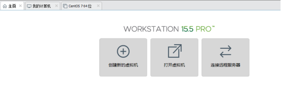

   3）选择自定义类型的配置，然后点击下一步。

   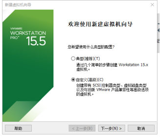

   4）硬件兼容性选择Workstation 15.x，然后点击下一步。

   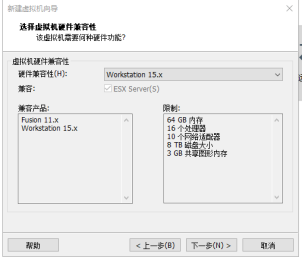

   5）选择“稍后安装操作系统”，点击下一步。

   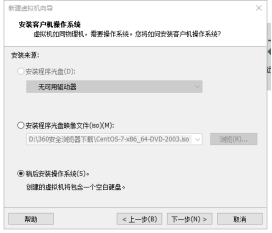

   6）选择客户机操作系统为“Linux”，版本为“CentOS 7 64 位”。

   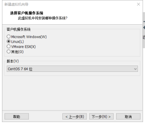

   7）命名虚拟机名称，并选择存放位置。

   ​                                            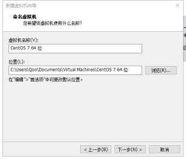

   8）进行处理器配置。

   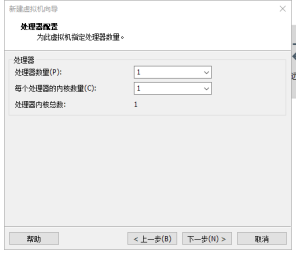

   9）选择此虚拟机的内存。

   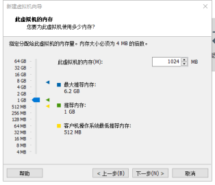

   10）选择网络类型。

   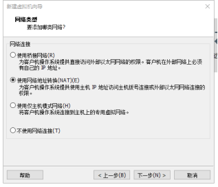

   11）选择I/O控制器类型。

   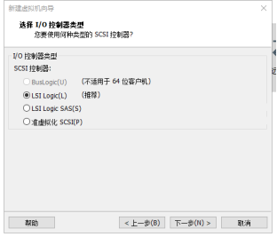

   12）选择磁盘类型。

   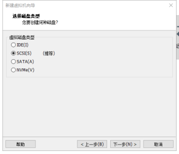

   13）选择使用的磁盘。

   ​                                             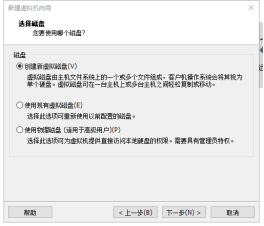

   14）指定磁盘容量。

   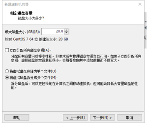

   15）指定磁盘文件。

   

   16）在虚拟机设置中，选择使用的的ISO映像文件。

   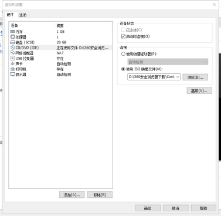

   ## （2）能够搭建Docker服务器

   1）先使用yum进行简单的安装

   2）修改主机名：

   

   3）使用yum安装 Docker

   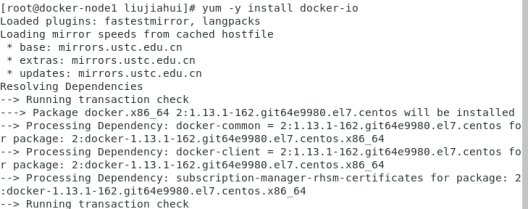

   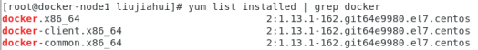

   4）鉴于国内网络问题，后续拉取 Docker 镜像十分缓慢，我们可以需要配置加速器来解决，我使用的是阿里的镜像地址：

   

   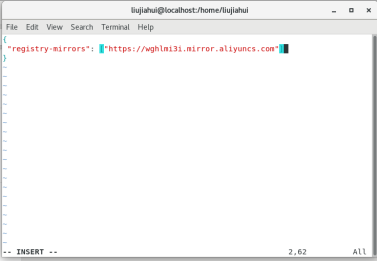

   5）启动 Docker 后台服务

   

5. ## 学习MarkDown 文档的使用，建议通过MarkDown整理自己的资料信息，并上传到Github。

